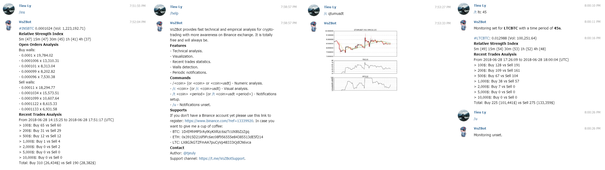

# VietnamOzBot (a.k.a. VozBot)

[](http://mrjbq7.github.io/ta-lib/)
[](https://opensource.org/licenses/MIT)

## Requirements

- Telegram library: python-telegram-bot
- Exchange library: python-binance
- Analysis libraries: numpy, TA-lib
- Visualization library: matplotlib
- Others: datetime

## Features

- Numeric technical analysis
- Visual analysis
- Buy / sell walls and trades analysis
- Notifications

## Run on local machine

```
pip install -r requirements.txt
pip install TA-lib
```

```
# For Windows
set TELEGRAM_TOKEN=XXXXXXXXXXXXXXXXXXXXXXXXXXXXXX 
set SECRET_KEY=XXXXXXXXXXXXXXXXXXXXXXXXXXXXXX 
set API_KEY=XXXXXXXXXXXXXXXXXXXXXXXXXXXXXX
python bot.py
```

```
# For Linus
export TELEGRAM_TOKEN=XXXXXXXXXXXXXXXXXXXXXXXXXXXXXX 
export SECRET_KEY=XXXXXXXXXXXXXXXXXXXXXXXXXXXXXX 
export API_KEY=XXXXXXXXXXXXXXXXXXXXXXXXXXXXXX
python bot.py
```

## Deployment on Heroku platform

```
heroku create --region eu vozbot 
heroku buildpacks:add --index 1 heroku/python
heroku buildpacks:add --index 2 https://github.com/numrut/heroku-buildpack-python-talib
heroku config:set TELEGRAM_TOKEN=XXXXXXXXXXXXXXXXXXXXXXXXXXXXXX
heroku config:set SECRET_KEY=XXXXXXXXXXXXXXXXXXXXXXXXXXXXXX
heroku config:set API_KEY=XXXXXXXXXXXXXXXXXXXXXXXXXXXXXX
git push heroku master
heroku ps:scale bot=1 
```

## Screenshots



## Licence
MIT

## Support and Donation

- Star and/or fork this repository
- Trade on Binance: https://www.binance.com/?ref=13339920
- BTC: 1DrEMhMP5rAytKyKXRzc6szTcUX8bZzZgq
- ETH: 0x3915D216f9Fc6ec08f956555e84385513dE5f214
- LTC: LX8GJkGTZFmAA7puCyVp48333iQdCN6vca
